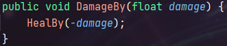

## Introduction
Ce jeu de type Shoot'Em Up n'a pas de nom. C'est un jeu destiné à montrer ma capacité à utiliser des structures de données cohérentes dans un temps limité (1 semaine).

## Mes intentions
Pour ce jeu, je veux créer un système tel quel:
- Bonus permanant: Des portails apparaîtront pour donner des bonus au joueur. Voici les différents type de portails :
	- Portail de vie : heal le joueur
	- Portail d'attaque : Upgrade l'attaque du joueur
	- Portail de vitesse d'attaque : Upgrade la vitesse d'attaque du joueur
- Ennemies :
	- Luge : Enemie par défaut. Il ne bouge pas et tire 2 laser toute les secondes
	- Rendroach : Le Rendroach est un kamikaze qui à la capacité de passer outre les défenses du joueur.
	- The boss: tire un rayon laser en plus de projectiles de base. Malheureusement, je n'ai pas eu le temps de tout implementer. The boss est dans une chaise roulante cassée actuellement.
- Les Effets a impact: (pas eu le temps)
	- Poison: inflige des dégats sur la durée

## Comment jouer
- Déplacements: WASD.
- Le tir est automatique.
- Les portails rouges augmentes l'attaque.
- Les portails orange augmentes la vitesse d'attaque.
- Les portails verts régenère votre barre de vie.
- Appuyer sur échap en jeu pour afficher le menu de pause.
- Dans le menu principal, vous pouvez changer l'affichage de la vie des entités.

## Les points que je veux mettre en avant
Sommaire:
- [Le système de vie](#le-système-de-vie)
- [Les bonus](#les-bonus)
- [Le Save & Load des niveaux](#le-save-&-load-des-niveaux)

### Le système de vie
La vie de toute les entitée est visible et détaché de tout le reste, rendant le system utilisable pour de futurs projets. 
Avoir une animation de mort null ne pose aucun problème puisque mon code le prend en compte. Mais la barre de vie est nécessaire.

 

Faire des dégats, c'est simplement soigner le joueur avec une valeur négative:

### Les bonus
Les bonus fonctionnent très simplement. 
Il vous suffit de :
- créer une classe enfant à Gate
- déclarer vos variables pour le bonus
- override la fonction Action (qui est obligatoire grâce à sa propriété `abstract`)

## Le Save & Load des niveaux
Le system de sauvegarde est quasiment le meme que pour les autres étudiants, mais ma structure est généralisée. Donc réutilisable. 
 

