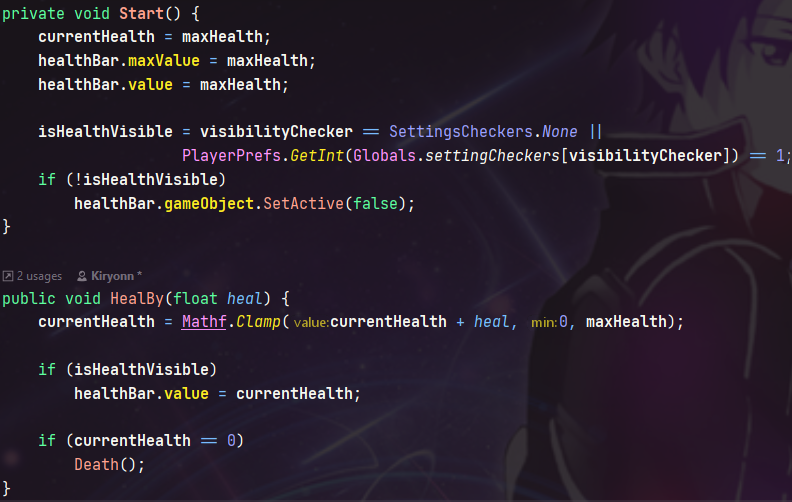

## Introduction
Ce jeu de type Shoot'Em Up n'a pas de nom. C'est un jeu destiné à montrer ma capacité à utiliser des structures de données cohérentes dans un temps limité (1 semaine).

## Mes intentions
Pour ce jeu, je veux créer un système tel quel:
- Bonus : Des portails apparaîtront pour donner des bonus au joueur. Voici les différents type de portails :
	- Portail de vie : heal le joueur
	- Portail d'attaque : Upgrade l'attaque du joueur
	- Portail de vitesse d'attaque : Upgrade la vitesse d'attaque du joueur
- Ennemies :
	- Luge : Enemie par défaut. Il ne bouge pas et tire 2 laser toute les secondes
	- Rendroach : Le Rendroach est un kamikaze qui à la capacité de passer outre les défenses du joueur.

## Les points que je veux mettre en avant

### Le système de vie
La vie de toute les entitée est visible et détaché de tout le reste, rendant le system utilisable pour de futurs projets. 
Avoir une animation de mort null ne pose aucun problème puisque mon code le prend en compte. Mais la barre de vie est nécessaire.
 
 
Vous aurez peut être remarqué la variable "visibilityChecker". Elle permet de verifier si le joueur veut afficher la vie de certaines entitée ou non. Par défaut, elle vaut None (enumeration) qui affiche la vie obligatoirement (utile pour le joueur et les boss).

### Les bonus
Les bonus fonctionnent très simplement. 
Il vous suffit de :
- créer une classe enfant à Gate
- déclarer vos variables pour le bonus
- override la fonction Action (qui est obligatoire grace a ca propriété `abstract`)

